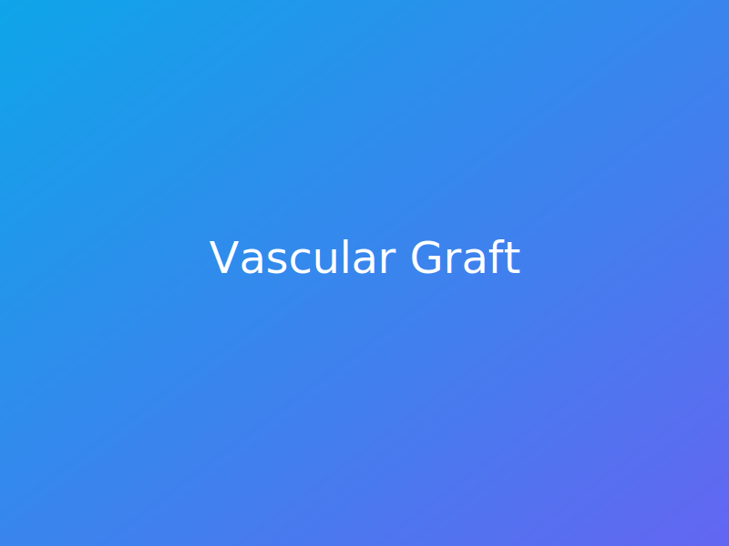

# Chen Bioengineering Lab Website

A modern, multi-page static website for the Chen Bioengineering Lab showcasing research, people, publications, news, and contact information. Built with HTML, Tailwind CSS (via CDN), and vanilla JavaScript for instant deployment on GitHub Pages.



## Features

- Responsive layout with sticky navigation, hero banners, and glassmorphism-inspired cards
- Dark mode toggle persisting via `localStorage`
- Publications rendered dynamically from JSON with download-ready BibTeX files
- Accessible forms, semantic markup, and SEO/Open Graph metadata
- Sitemap and robots instructions for search indexing

## Getting Started

1. Create a new repository named `<USERNAME>.github.io` on GitHub.
2. Clone the repository locally or upload the files from this project structure:

```
.
├── index.html
├── research.html
├── people.html
├── publications.html
├── news.html
├── contact.html
├── sitemap.xml
├── robots.txt
├── assets
│   ├── css
│   │   └── custom.css
│   ├── data
│   │   └── publications.json
│   ├── img
│   │   ├── member-placeholder.svg
│   │   ├── news-placeholder.svg
│   │   ├── pi-chen.svg
│   │   ├── project-graft.svg
│   │   ├── project-patch.svg
│   │   └── project-piezo.svg
│   └── js
│       ├── darkmode.js
│       └── pubs.js
└── README.md
```

3. Commit the files and push to your GitHub repository.
4. In the repository settings, navigate to **Pages** and set the source to the `main` branch and `/ (root)` directory.
5. Visit `https://<USERNAME>.github.io` to see the site live.

## Customization

- **Text & imagery:** Update the HTML files directly or replace the placeholder SVGs in `assets/img/` with your own images (keep filenames consistent or update references in the HTML).
- **Publications:** Edit `assets/data/publications.json`. Each entry requires `year`, `title`, `authors`, `venue`, `link`, and `bibtex` fields.
- **Styling tweaks:** Add styles in `assets/css/custom.css` or adjust Tailwind utility classes within the HTML.
- **Dark mode:** The toggle uses `assets/js/darkmode.js`; modify the script for additional themes if desired.

## License

This project is provided as a template. Adapt and reuse for your research laboratory as needed.
